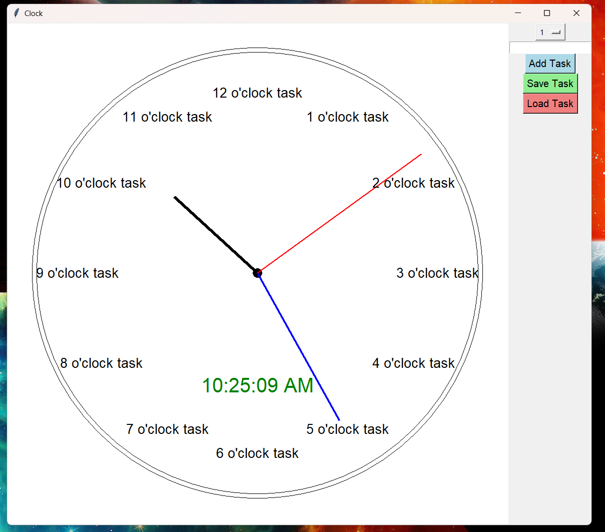
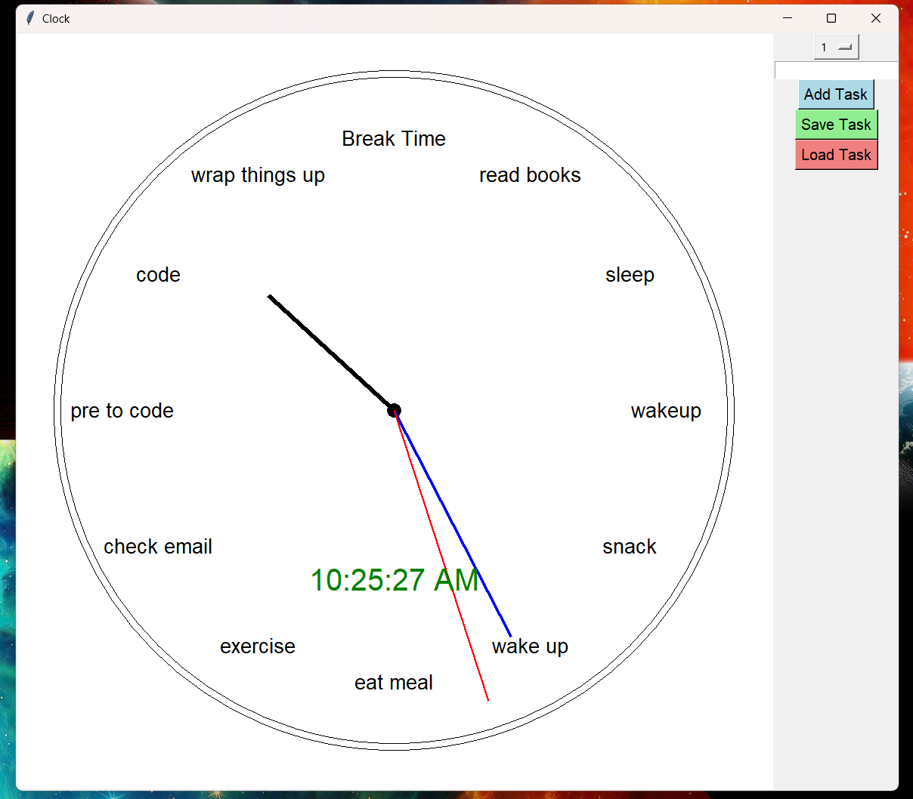

# TaskClock
A simple task clock app using python

## Requirements:
1. [python version 3.9.7 and later](https://www.python.org/downloads/)
2. [tkinter](https://pypi.org/project/tkintertable/)
3. [time](https://pypi.org/project/TIME-python/)
4. [math](https://pypi.org/project/python-math/)

<div style="display: flex; justify-content: center; gap: 20px;">
   
   
</div>

## 🖼️ Example

Here are the packages imports:

```python
import tkinter as tk
import time
import math
```

The clock class:

```python
class Clock:
    def __init__(self, root):
        self.root = root
        self.root.title("Clock")
        self.canvas = tk.Canvas(root, width=1000, height=1000, bg='white')
        self.canvas.pack(side=tk.LEFT)
        self.center_x = 500
        self.center_y = 500
        self.radius = 450

        self.tasks = [
            "1 o'clock task", "2 o'clock task", "3 o'clock task", "4 o'clock task", "5 o'clock task",
            "6 o'clock task", "7 o'clock task", "8 o'clock task", "9 o'clock task", "10 o'clock task",
            "11 o'clock task", "12 o'clock task"
        ]

        self.create_task_editor()
        self.update_clock()
```
Task Editor Function:

```python
    def create_task_editor(self):
        self.editor_frame = tk.Frame(self.root)
        self.editor_frame.pack(side=tk.RIGHT, fill=tk.Y)

        self.hour_var = tk.StringVar(self.editor_frame)
        self.hour_var.set("1")
        self.hours = [str(i) for i in range(1, 13)]
        self.hour_menu = tk.OptionMenu(self.editor_frame, self.hour_var, *self.hours)
        self.hour_menu.pack()

        self.task_entry = tk.Entry(self.editor_frame)
        self.task_entry.pack()

        self.add_task_button = tk.Button(self.editor_frame, text="Add Task", command=self.add_task, bg='lightblue', font=("Helvetica", 12))
        self.add_task_button.pack()
        
        self.add_save_button = tk.Button(self.editor_frame, text="Save Task", command=self.saveTaskasText, bg='lightgreen', font=("Helvetica", 12))
        self.add_save_button.pack()
        
        self.add_load_button = tk.Button(self.editor_frame, text="Load Task", command=self.loadTasksfromText, bg='lightcoral', font=("Helvetica", 12))
        self.add_load_button.pack()
```
Add Task:

```python
    def add_task(self):
        hour = int(self.hour_var.get())
        task = self.task_entry.get()
        self.tasks[hour - 1] = task
        self.update_clock()
        self.task_entry.delete(0, tk.END)
```

Hands of the clocks:

```python
    def draw_hand(self, angle, length, width, color):
        angle_rad = math.radians(angle)
        x = self.center_x + length * math.sin(angle_rad)
        y = self.center_y - length * math.cos(angle_rad)
        self.canvas.create_line(self.center_x, self.center_y, x, y, width=width, fill=color)
```

Display Tasks:

```python
    def draw_task(self, hour, text):
        angle = (hour % 12) * 30
        angle_rad = math.radians(angle)
        x = self.center_x + self.radius * 0.8 * math.sin(angle_rad)
        y = self.center_y - self.radius * 0.8 * math.cos(angle_rad)
        self.canvas.create_text(x, y, text=text, font=("Helvetica", 16), anchor=tk.CENTER)
```

Update Clock Contents:

```python
    def update_clock(self):
        self.canvas.delete("all")
        
        # Draw the outer clock frame
        self.canvas.create_oval(self.center_x - self.radius, self.center_y - self.radius,
                                self.center_x + self.radius, self.center_y + self.radius, width=1)

        # Draw the inner clock frame
        inner_radius = self.radius * 0.98
        self.canvas.create_oval(self.center_x - inner_radius, self.center_y - inner_radius,
                                self.center_x + inner_radius, self.center_y + inner_radius, width=1)
        
        inner_center = self.radius * 0.02
        self.canvas.create_oval(self.center_x - inner_center, self.center_y - inner_center,
                                self.center_x + inner_center, self.center_y + inner_center, fill='black')

        current_time = time.localtime()
        hours = current_time.tm_hour % 12
        minutes = current_time.tm_min
        seconds = current_time.tm_sec

        # Draw hour hand
        hour_angle = (hours + minutes / 60) * 30
        self.draw_hand(hour_angle, self.radius * 0.5, 6, 'black')

        # Draw minute hand
        minute_angle = (minutes + seconds / 60) * 6
        self.draw_hand(minute_angle, self.radius * 0.75, 4, 'blue')

        # Draw second hand
        second_angle = seconds * 6
        self.draw_hand(second_angle, self.radius * 0.9, 2, 'red')

        # Add tasks at specific clock positions
        for i in range(12):
            self.draw_task(i + 1, self.tasks[i])

        # Add current time as text in the center of the clock
        time_string = time.strftime("%I:%M:%S %p", current_time)
        self.canvas.create_text(self.center_x, self.center_y + self.radius * 0.5, text=time_string, font=("Helvetica", 24), fill='green')

        self.root.after(1000, self.update_clock)
```

Save Tasks:

```python
    def saveTaskasText(self):
        with open("tasks.txt", "w") as file:
            for task in self.tasks:
                file.write(task + "\n")
```

Load the tasks from task.txt:

```python
    def loadTasksfromText(self):
        with open("tasks.txt", "r") as file:
            tasks = file.readlines()
            self.tasks = [task.strip() for task in tasks]
            self.update_clock()
```

Execute the app in a loop:

```python
if __name__ == "__main__":
    root = tk.Tk()
    clock = Clock(root)
    root.mainloop()
```